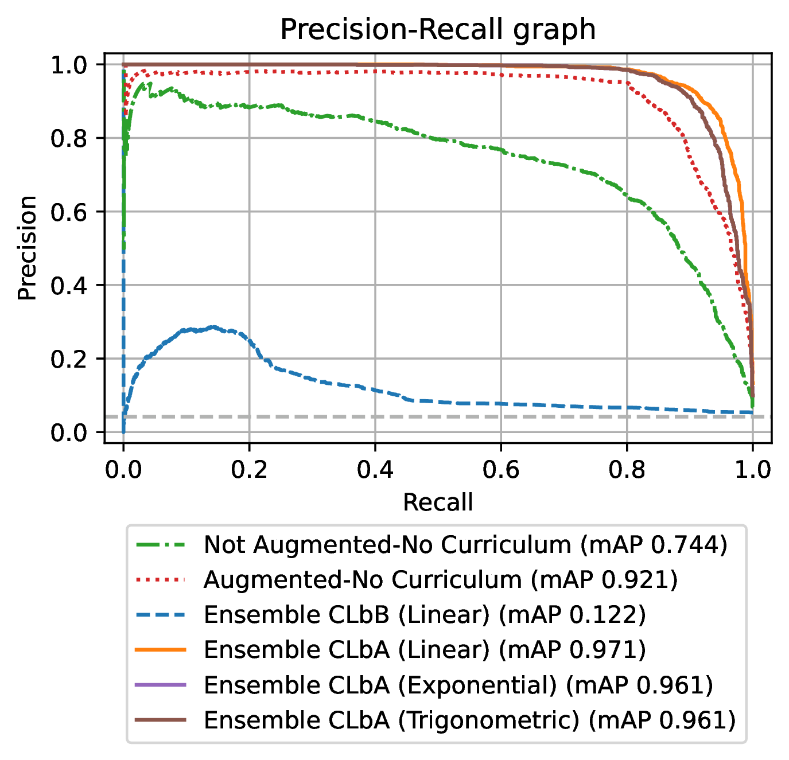
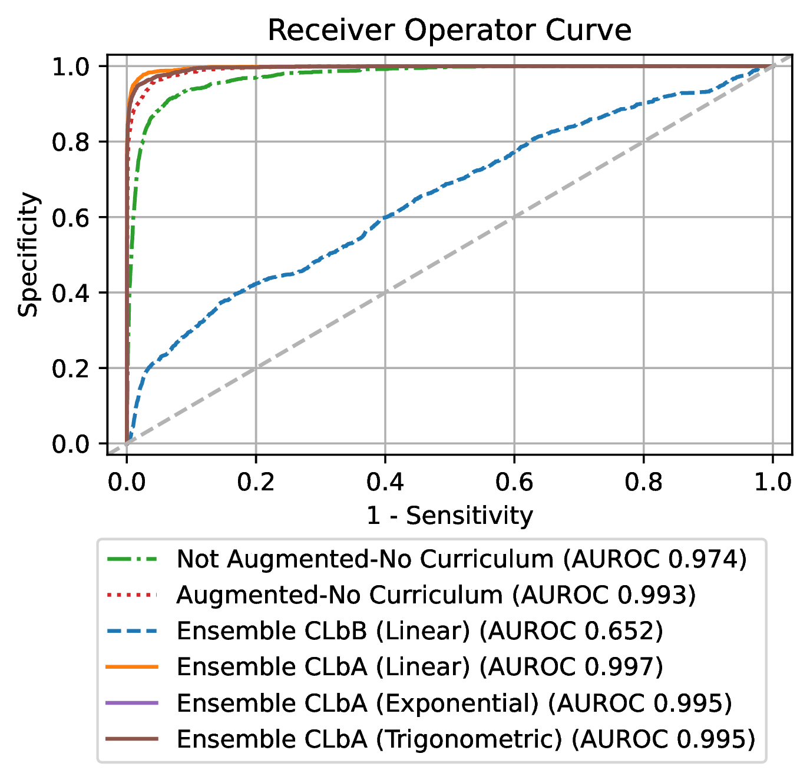

# Faster, Better Blink Detection using Curriculum Learning By Augmentation

## License + Attribution
This code is licensed under [CC BY-NC-SA 4.0](https://creativecommons.org/licenses/by-nc-sa/4.0/). Commercial usage is not permitted.

More information can be found on the Personal Robotic Lab's website: <https://www.imperial.ac.uk/personal-robotics/software/>.

## Requirements
### Pytorch
For conda users: `conda install -c conda-forge numpy scipy tqdm pillow rospkg opencv scikit-learn h5py matplotlib pytorch-lightning && conda install -c pytorch pytorch torchvision`

An HDF5 file is required, to generate this run [GenerateRTBENEH5Dataset.py](util/GenerateRTBENEH5Dataset.py) with the argument to locate the RT-BENE dataset.
[train_model](train_model.py) contains the code required to train the model.
### Eyepatch generation
See [https://github.com/ahmed-alhindawi/rt_gene/blob/master/rt_gene_model_training/utils/GenerateEyePatchesRTGENEDataset.py](this script) to generate eye patches for model training (only needed on custom datasets)

## Model testing code

Evaluation code for 3-fold validation is in [evaluate_model.py](evaluate_model.py)

